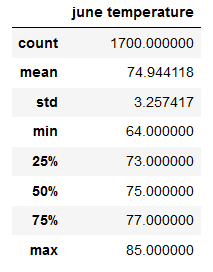
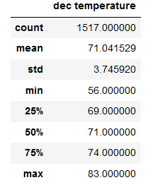

# surfs_up 

Surfs_up is all about weather analysis for Surf & Ice-cream shop. Analyse the weather data across Oahu - a potential Hawaii Island to invest and setup a Surf & Ice-cream shop.

## Overview of the analysis
Surfs Up, is about surf & icecream shop business venture in Oahu, an Hawaiian Island. Based on the weather data collected across Oahu in SQLite database, analysis has to be performed using SQLAlchemy in Pandas to determine the exact location for Surf 'n Shake(Surf shop) in Oahu for the viability of a business that combines the sale of surfing products with the sale of milkshakes and ice cream. 
 
For the surfs_up - Weather analysis for Surf & Ice-cream shop includes the following steps,
* Query the Hawaii.sqlite database to retrieve temperatures for June and December.
* Convert the June and December temperatures into a list and put the list into a DataFrame.
* Generate summary statistics for the months of both June and December.

## Results

Weather data was collected across the Oahu island with the help of 9 Weather stations.
Weather data was stored in the sqlite DB from the year 2010 to 2017.
The weather statistics were compared during the mid of the year and end of the year, for the month of june and december with the data across Oahu.

Below is the summary statistics of the months of June and December,

June Temperature                        |  December Temperature       
:--------------------------------------:|:-------------------------:
  |  

* The standard deviation of June and December are 3.25 and 3.74.

* Minimum temperature for the month of June is 64.0 and for the month of Dec is 56.0. 

* The percentile stats shows the proportionate dropping of temps in december when compared to that of june.

## Summary

After comparing the summary statistics between June and December that is mid and end of the year, showing there is not a significant difference, the analysis seems reliable and dependable to take a decision on investing for a surf and ice-cream shop.

Two additional queries that performed to gather more weather data for June and December.
* Query to calculate the median of the temperatures on the dataframes created for june and december is as below,

 

* Calculate the min, max and avg temperatures in active stations/on particular station using station id, helps to find the perfect place for the business. 

- Query to find the active stations is as below,
 

- Query to find some more analysis on temperature on different active stations, USC00519281 and USC00513117 is as below,

 

 

When we compare the data of the above two active stations, USC00513117 station has min temp of 63.0 and the max temp of 80 even in december. 

Using the above query, we can perform temperature analysis on different stations. In that way we can easily choose the best station for the business. 

